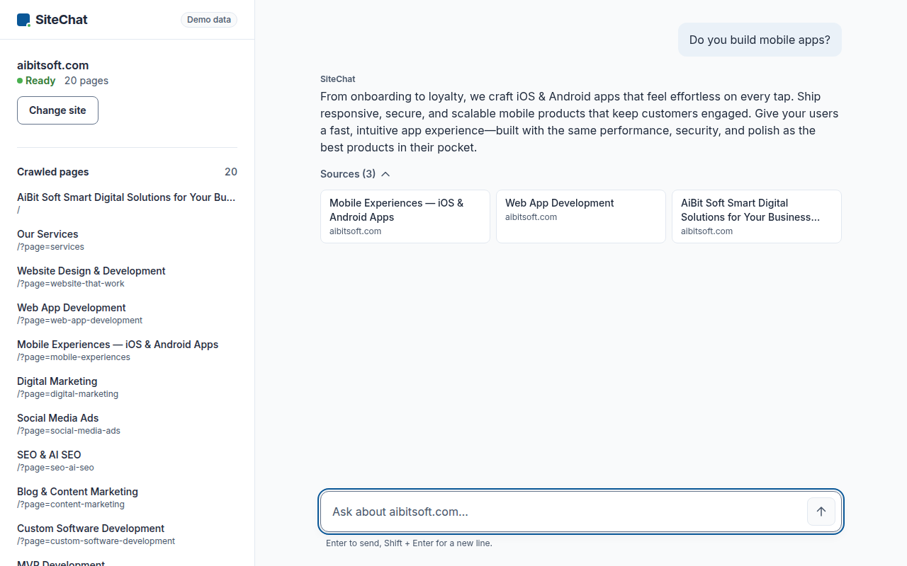
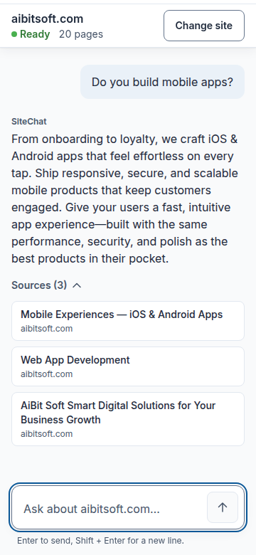
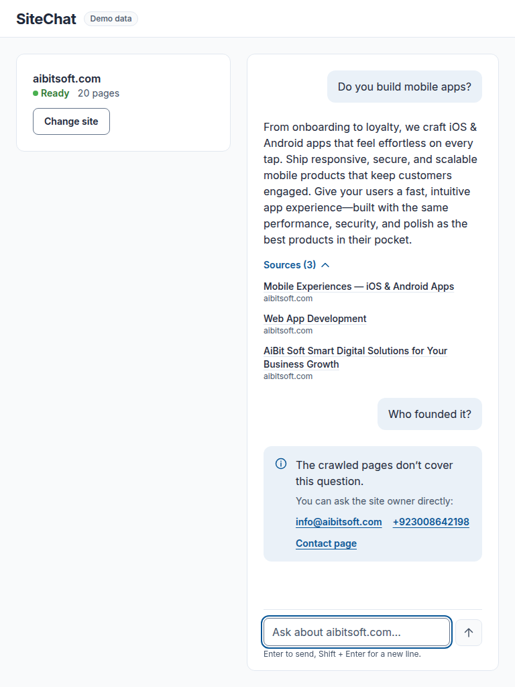
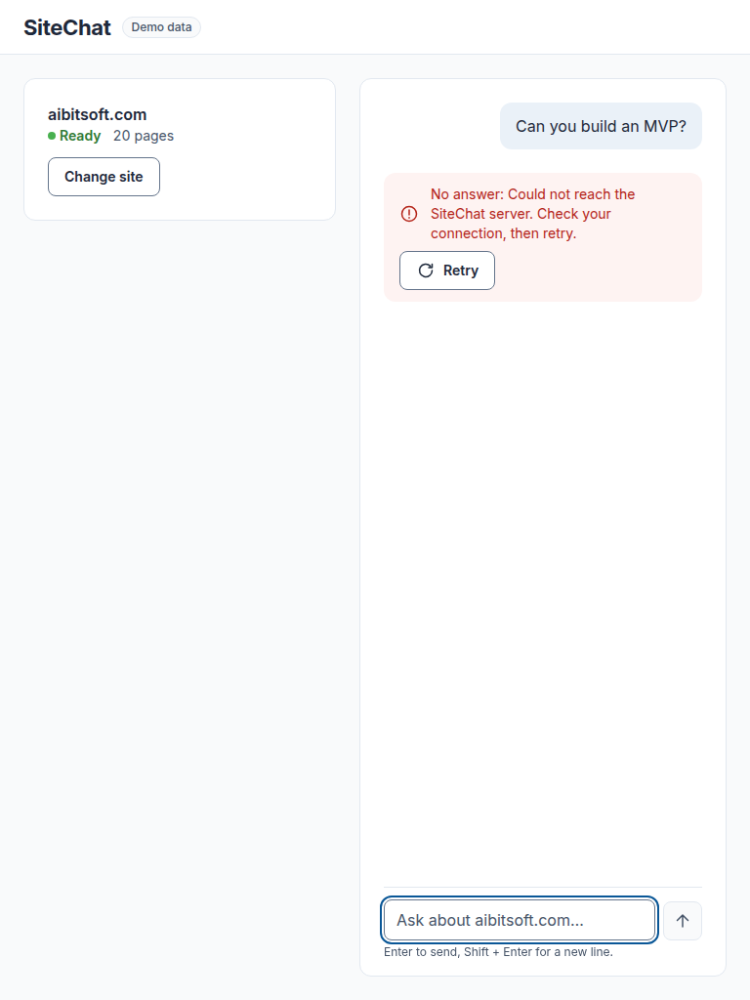
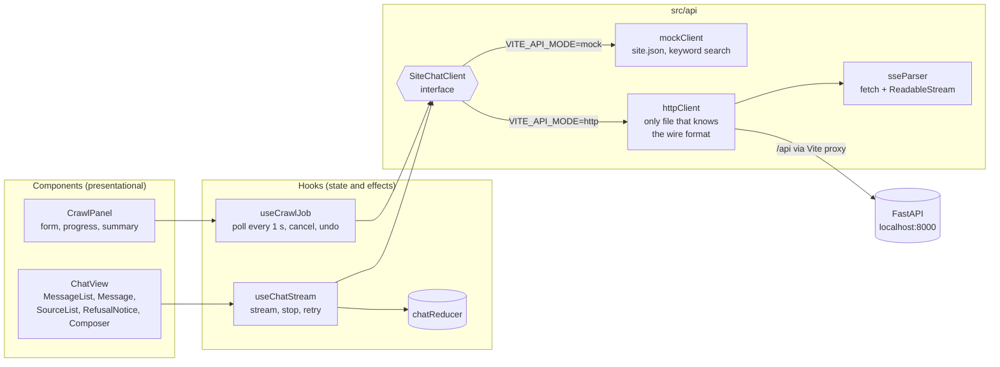

# SiteChat

Crawl a website, then ask it questions. Answers stream in token by token, come only from the crawled pages, and list their sources. When the pages do not cover a question, SiteChat refuses and shows the site's contact details instead of guessing.

This repository is the React frontend. The backend (Python FastAPI: crawler, hybrid retrieval, LLM with refusal) is a separate service. The frontend also ships a **mock mode**, built from 20 real pages of aibitsoft.com, that runs with no backend and no internet.



| Phone (360 px) | Refusal | Network error with Retry |
|---|---|---|
|  |  |  |

All 15 states at three widths are in [`docs/screenshots/`](docs/screenshots/), indexed in [`docs/verification.md`](docs/verification.md).

## Run it

Needs Node 20.19+ or 22.12+ (Vite 8).

```bash
npm i
npm run dev          # http://localhost:5173, mock mode by default
```

| Mode | How | What answers |
|---|---|---|
| Mock (default) | `npm run dev` | `src/api/mockClient.ts`, offline, over `src/mocks/site.json`. Header badge: **Demo data**. |
| Live | `VITE_API_MODE=http npm run dev` | The FastAPI backend, proxied from `/api` to `http://localhost:8000` (`vite.config.ts`). Header badge: **Live**. |

Any value other than `http` falls back to mock, so a typo can never point a demo at a backend that is not running. `?simulate=chat-error` makes the first mock question fail, to show the error state and Retry offline.

| Script | Does |
|---|---|
| `npm run build` | Type-check (strict) and build to `dist/` |
| `npm run lint` | ESLint with `typescript-eslint` and `react-hooks` |
| `npm test` | Vitest: 52 unit and component tests |
| `npm run test:e2e` | Playwright happy path against the production build (run `npx playwright install chromium` once) |

## Architecture



- **Components only render.** State and effects live in hooks: `useCrawlJob` in `App`, `useChatStream` in `ChatView`. A new crawl remounts `ChatView` (keyed by job id), so an old stream can never write into a new conversation.
- **The API contract is assumed** (`src/api/types.ts`), because the backend source was not available. `httpClient.ts` is the only file that knows URLs, JSON field names and SSE event names, so reconciling with the real API is a change to that one file.
- **Chat streams over `fetch`**, because `EventSource` cannot send a POST body. `sseParser.ts` rebuilds events split across network chunks, including a split `\r\n` and a split multi-byte character.
- **Everything cancellable takes an `AbortSignal`:** Stop, Cancel crawl, a new crawl, unmount.

## Project layout

```text
src/
  api/         types, client interface, httpClient, sseParser, mockClient (+ mockSearch, mockText)
  hooks/       useCrawlJob, useChatStream, useCrawlForm, useComposer, useAutoScroll, useFocusWhenLost
  state/       chatReducer
  components/  CrawlPanel, BudgetPicker, ChatView, MessageList, Message, SourceList,
               RefusalNotice, Composer, StatusBadge, Button, Icon
  styles/      tokens.css (from docs/DESIGN.md), global.css
  mocks/       site.json (20 pages captured from aibitsoft.com)
e2e/           happy-path.spec.ts
docs/          DESIGN.md, DECISIONS.md, DEMO.md, audit.md, verification.md, screenshots/, brand-capture/
public/fonts/  Inter (OFL), self-hosted for the offline demo
```

## Constraints this was built to

React 18 and TypeScript strict with function components only. CSS Modules and custom-property tokens, with no UI kit, Tailwind, animation library or icon font. Runtime dependencies are `react` and `react-dom` only. No file is over 150 lines. Light theme only. Contrast is AA, measured and recorded in `docs/DESIGN.md`.

## Mock data and its limits

`src/mocks/site.json` is 20 pages captured from aibitsoft.com with `playwright-cli` (text trimmed to 1,500 characters), plus the contact details from the site's own `mailto:` and `tel:` links.

The mock ranks pages by keyword overlap, weighted by how rare each word is across the pages. It answers only with sentences copied word for word from the best page, and refuses below a 0.75 match. On 34 labelled questions it wrongly answered none of the 11 it should refuse, and wrongly refused 2 of the 23 it should answer, both for vocabulary reasons. See [`docs/DEMO.md`](docs/DEMO.md).

Answers are therefore the site's own marketing copy, not neutral facts.

## Docs

- [`docs/DESIGN.md`](docs/DESIGN.md): the design system (tokens, type, spacing, radius, component rules).
- [`docs/DECISIONS.md`](docs/DECISIONS.md): key technical decisions and the alternatives rejected.
- [`docs/DEMO.md`](docs/DEMO.md): a 3-minute demo script, the question guide, and likely panel questions.
- [`docs/audit.md`](docs/audit.md): the Web Interface Guidelines audit, with each finding fixed or justified.
- [`docs/verification.md`](docs/verification.md): screenshots, console check, keyboard-only run, and e2e mutation checks.
